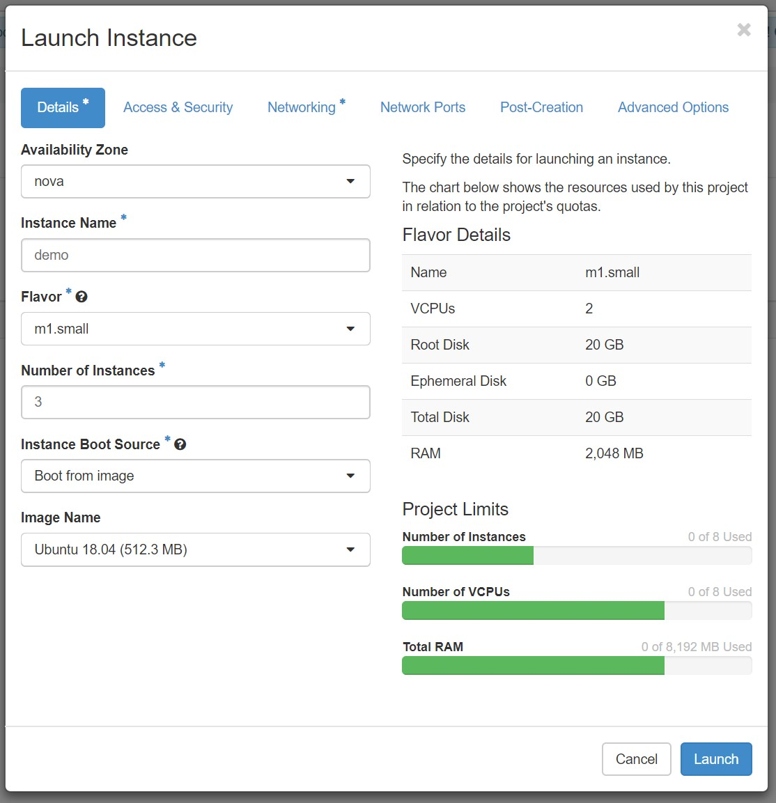

# Docker Swarm on Cybera Cloud

This repository includes tutorials about running and testing Docker Swarm mode
on the Cybera cloud. In this tutorial, we assume that you already have a Cybera
account and you have the quota to create at least 2 VMs which could be clustered together.

- To get access to the Cybera cloud request for an account [here](https://rac-portal.cybera.ca).
  - Choose the option to sign in using your institution account.
- You can login to the portal after getting access [here](https://cloud.cybera.ca/auth/login/).
- You need network access to you VMs (they have internal IP addresses).
  - To do so, install [OpenVPN](https://openvpn.net/) version 2.4.6.
  - Follow the instructions from [here](https://wiki.cybera.ca/display/RAC/Rapid+Access+Cloud+Virtual+Private+Network) to connect
    to the internal network.


# Create Virtual Machines



- Create 3 VMs with "m1.small" flavor, instance boot source set to boot from image
and image name of "Ubuntu 18.04".
- In the access and security section, create a new key pair if you don't already have one.
- Wait for the VMs to boot up and be available.
- Ping your VMs to make sure you have network access to them (you might need to enable
  ICMP access in the network security groups section). Also allow TCP port 22 for ssh
  connection.

```
ping 10.1.X.X

ssh -i PRIVATE_KEY_FILE ubuntu@10.1.X.X
```

# Open the TCP Ports

Open up the following TCP ports in the `default` security group in the OpenStack.

- 22 (ssh), 2376 and 2377 (Swarm), 80 (nginx), 8000 (web app)
- You can do this on Cybera by going to `Network` menu and `Security Groups` on the left pane.

# Install Docker
```
sudo apt-get update && sudo apt-get -y install docker.io docker-compose
sudo apt-get install -y apt-transport-https
sudo swapoff -a
sudo systemctl enable docker
```

Then finalize the installation (to enable non-sudo user to run docker commands):

```
docker ps
sudo docker ps

sudo usermod -aG docker $USER
sudo chown "$USER":"$USER" /home/"$USER"/.docker -R
sudo chmod g+rwx "/home/$USER/.docker" -R
sudo chown "$USER":"$USER" /var/run/docker.sock
sudo chmod g+rwx /var/run/docker.sock -R
sudo systemctl enable docker
```

# Create a Cluster for Swarm
For creating this section, we use [this tutorial](https://rominirani.com/docker-swarm-tutorial-b67470cf8872). You can
follow that one or just go through the commands that we have here.

First, select one of the VMs to be the swarm manager. Run this command on the manager:
```
docker swarm init --advertise-addr MANAGER_IP
```

You would see an output like this:
```
ubuntu@demo-1:~$ docker swarm init --advertise-addr 10.1.13.200
Swarm initialized: current node (pim3mrnkpuil1bmz22zk47ta5) is now a manager.

To add a worker to this swarm, run the following command:

    docker swarm join --token SWMTKN-1-1p2uxmaslgwpqpqoh235vrsgs760krohb8h4m8lbgucbooyxsr-ahga65ag49n796e2xs0uqeru8 10.1.13.200:2377

To add a manager to this swarm, run 'docker swarm join-token manager' and follow the instructions.
```

This basically tells us two things. First of all, the cluster has been initialized with success. Second, it gives us a command to
run on the other nodes to join the cluster. Make sure to open the port 2377 on your network security group so that workers can
contact manager on that port. Running this command on the workers would produce an output like this:

```
ubuntu@demo-2:~$ docker swarm join --token SWMTKN-1-1p2uxmaslgwpqpqoh235vrsgs760krohb8h4m8lbgucbooyxsr-ahga65ag49n796e2xs0uqeru8 10.1.13.200:2377
This node joined a swarm as a worker.
```

Now you can see a list of nodes that have joined the cluster:

```
ubuntu@demo-1:~$ docker node ls
ID                            HOSTNAME            STATUS              AVAILABILITY        MANAGER STATUS      ENGINE VERSION
pim3mrnkpuil1bmz22zk47ta5 *   demo-1              Ready               Active              Leader              18.06.1-ce
u0ec1dq0xapvr7065ehk2737v     demo-2              Ready               Active                                  18.06.1-ce
plgix2rzgicdnhcfd92vapgyt     demo-3              Ready               Active                                  18.06.1-ce
```

This means you a working cluster that you can use to deploy services and other stuff on.

# Docker Services
## Create a Service

To create a service, run the following command:

```
docker service create --replicas 5 -p 80:80 --name web nginx
```

After a few seconds, 5 instances of the nginx image should be up and running. Get a list of services on this cluster:

```
docker service ls
```

The output should be similar to this one:

```
ubuntu@demo-1:~$ docker service ls
ID                  NAME                MODE                REPLICAS            IMAGE               PORTS
togwgnzoyv9g        web                 replicated          5/5                 nginx:latest        *:80->80/tcp
```

Open up the TCP port 80 on your network security
group to be able to access the resulting webpage.
Now, open up a browser and go to the following address:

```
http://VM1_IP:80
```

Now, try out other VMs IPs. As you can see, it doesn't matter which IP you use,
you will see the same results. This is because docker creates a virtual network
in the cluster and load balances the traffic between different VMs that have
the same image running on them. Let's take a look at the resulting containers:

```
ubuntu@demo-1:~$ docker service ps web
ID                  NAME                IMAGE               NODE                DESIRED STATE       CURRENT STATE           ERROR               PORTS
2zrudha3t6l2        web.1               nginx:latest        demo-2              Running             Running 6 minutes ago
rg8aqd16q1mm        web.2               nginx:latest        demo-3              Running             Running 6 minutes ago
j02oztr36mze        web.3               nginx:latest        demo-2              Running             Running 6 minutes ago
di44u33sciel        web.4               nginx:latest        demo-3              Running             Running 6 minutes ago
o7vcojo611lz        web.5               nginx:latest        demo-1              Running             Running 6 minutes ago
```

As you can see docker automatically distributes your running instances among different VMs to make sure
you have a good availability even if some of your nodes go down.

## Scaling up/down

```
docker service scale web=8
```

After a few seconds, you instances should increase to 8:

```
ubuntu@demo-1:~$ docker service ps web
ID                  NAME                IMAGE               NODE                DESIRED STATE       CURRENT STATE            ERROR               PORTS
2zrudha3t6l2        web.1               nginx:latest        demo-2              Running             Running 10 minutes ago
rg8aqd16q1mm        web.2               nginx:latest        demo-3              Running             Running 10 minutes ago
j02oztr36mze        web.3               nginx:latest        demo-2              Running             Running 10 minutes ago
di44u33sciel        web.4               nginx:latest        demo-3              Running             Running 10 minutes ago
o7vcojo611lz        web.5               nginx:latest        demo-1              Running             Running 10 minutes ago
904dzwvxr9ww        web.6               nginx:latest        demo-1              Running             Running 26 seconds ago
gg2r9s2mq2ay        web.7               nginx:latest        demo-3              Running             Running 30 seconds ago
lxx8fnhknjps        web.8               nginx:latest        demo-1              Running             Running 27 seconds ago
```

You could also inspect the nodes:

```
docker node inspect self
docker node inspect demo-2
```

## Deleting the service

```
docker service rm web
```

# Docker Stack

For this part, I am using [this tutorial](https://docs.docker.com/engine/swarm/stack-deploy/).

## Create a Stack

```
git clone https://github.com/DDSystemLab/cybera-docker-swarm
cd cybera-docker-swarm/stackdemo/
docker-compose up -d
```

You should see an output like this:

```
ubuntu@demo-1:~/cybera-docker-swarm/stackdemo$ docker-compose up -d
WARNING: The Docker Engine you're using is running in swarm mode.

Compose does not use swarm mode to deploy services to multiple nodes in a swarm. All containers will be scheduled on the current node.

To deploy your application across the swarm, use `docker stack deploy`.

Creating network "stackdemo_default" with the default driver
Building web
Step 1/5 : FROM python:3.4-alpine
3.4-alpine: Pulling from library/python
6c40cc604d8e: Pull complete
eb28c72fd5c9: Pull complete
21863ada74e5: Pull complete
476baf747d43: Pull complete
fc7969bf37b6: Pull complete
Digest: sha256:ef9bb2aa4fc7136124ff54ca6a8cfe9a8c15aa622a2085ec2712e34c73f97d5f
Status: Downloaded newer image for python:3.4-alpine
 ---> 9a7a786215fc
Step 2/5 : ADD . /code
 ---> 484480703654
Step 3/5 : WORKDIR /code
 ---> Running in bc98bcb1e3a4
Removing intermediate container bc98bcb1e3a4
 ---> c7bad80b7bc4
Step 4/5 : RUN pip install -r requirements.txt
 ---> Running in 3b4d6d3753d6
DEPRECATION: Python 3.4 support has been deprecated. pip 19.1 will be the last one supporting it. Please upgrade your Python as Python 3.4 won't be maintained after March 2019 (cf PEP 429).
Collecting flask (from -r requirements.txt (line 1))
  Downloading https://files.pythonhosted.org/packages/7f/e7/08578774ed4536d3242b14dacb4696386634607af824ea997202cd0edb4b/Flask-1.0.2-py2.py3-none-any.whl (91kB)
Collecting redis (from -r requirements.txt (line 2))
  Downloading https://files.pythonhosted.org/packages/d0/8b/c43ef27d02382853b22c49bc41a8389e47d60811dd1d72b9a45bc905a5f8/redis-3.2.0-py2.py3-none-any.whl (65kB)
Collecting Werkzeug>=0.14 (from flask->-r requirements.txt (line 1))
  Downloading https://files.pythonhosted.org/packages/20/c4/12e3e56473e52375aa29c4764e70d1b8f3efa6682bef8d0aae04fe335243/Werkzeug-0.14.1-py2.py3-none-any.whl (322kB)
Collecting Jinja2>=2.10 (from flask->-r requirements.txt (line 1))
  Downloading https://files.pythonhosted.org/packages/7f/ff/ae64bacdfc95f27a016a7bed8e8686763ba4d277a78ca76f32659220a731/Jinja2-2.10-py2.py3-none-any.whl (126kB)
Collecting itsdangerous>=0.24 (from flask->-r requirements.txt (line 1))
  Downloading https://files.pythonhosted.org/packages/76/ae/44b03b253d6fade317f32c24d100b3b35c2239807046a4c953c7b89fa49e/itsdangerous-1.1.0-py2.py3-none-any.whl
Collecting click>=5.1 (from flask->-r requirements.txt (line 1))
  Downloading https://files.pythonhosted.org/packages/fa/37/45185cb5abbc30d7257104c434fe0b07e5a195a6847506c074527aa599ec/Click-7.0-py2.py3-none-any.whl (81kB)
Collecting MarkupSafe>=0.23 (from Jinja2>=2.10->flask->-r requirements.txt (line 1))
  Downloading https://files.pythonhosted.org/packages/b9/2e/64db92e53b86efccfaea71321f597fa2e1b2bd3853d8ce658568f7a13094/MarkupSafe-1.1.1.tar.gz
Building wheels for collected packages: MarkupSafe
  Building wheel for MarkupSafe (setup.py): started
  Building wheel for MarkupSafe (setup.py): finished with status 'done'
  Stored in directory: /root/.cache/pip/wheels/f2/aa/04/0edf07a1b8a5f5f1aed7580fffb69ce8972edc16a505916a77
Successfully built MarkupSafe
Installing collected packages: Werkzeug, MarkupSafe, Jinja2, itsdangerous, click, flask, redis
Successfully installed Jinja2-2.10 MarkupSafe-1.1.1 Werkzeug-0.14.1 click-7.0 flask-1.0.2 itsdangerous-1.1.0 redis-3.2.0
Removing intermediate container 3b4d6d3753d6
 ---> fa0d7ae2f124
Step 5/5 : CMD ["python", "app.py"]
 ---> Running in 7dcaf0c86235
Removing intermediate container 7dcaf0c86235
 ---> be0777971e40
Successfully built be0777971e40
Successfully tagged 127.0.0.1:5000/stackdemo:latest
WARNING: Image for service web was built because it did not already exist. To rebuild this image you must use `docker-compose build` or `docker-compose up --build`.
Pulling redis (redis:alpine)...
alpine: Pulling from library/redis
6c40cc604d8e: Already exists
e42672a2ca6a: Pull complete
823e4275fef6: Pull complete
c2ad7a3b6c3f: Pull complete
327e62bcfef7: Pull complete
be5997a801f5: Pull complete
Digest: sha256:3fa51e0b90b42ed2dd9bd87620fe7c45c43eb4e1f81c83813a78474cbe2f7457
Status: Downloaded newer image for redis:alpine
Creating stackdemo_web_1 ...
Creating stackdemo_redis_1 ...
Creating stackdemo_redis_1
Creating stackdemo_web_1 ... done

```

Take a look at the containers created:
```
docker-compose ps
```

output:

```
ubuntu@demo-1:~/cybera-docker-swarm/stackdemo$ docker-compose ps
      Name                     Command               State           Ports
-----------------------------------------------------------------------------------
stackdemo_redis_1   docker-entrypoint.sh redis ...   Up      6379/tcp
stackdemo_web_1     python app.py                    Up      0.0.0.0:8000->8000/tcp
```

As you can see, both out containers are up and running here. It might take a few seconds for them to get ready.

Allow TCP port 8000 to be able to see the output in the following address:

```
http://VM_IP:8000
```

The result would be a page with the following content:

```
ubuntu@demo-1:~/cybera-docker-swarm/stackdemo$ curl http://localhost:8000
Hello World! I have been seen 1 times.
```

As you can see, refreshing this page causes the number to rise. We just deployed an stack with 2 different images using a
single command. You can deploy very complicated stacks using docker swarm.

## Delete the stack

```
docker-compose down --volumes
```

output:

```
ubuntu@demo-1:~/cybera-docker-swarm/stackdemo$ docker-compose down --volumes
Stopping stackdemo_web_1   ... done
Stopping stackdemo_redis_1 ... done
Removing stackdemo_web_1   ... done
Removing stackdemo_redis_1 ... done
Removing network stackdemo_default

```

# Clear Everything

When you are done with your swarm, just delete all the instances from the cybera portal.
